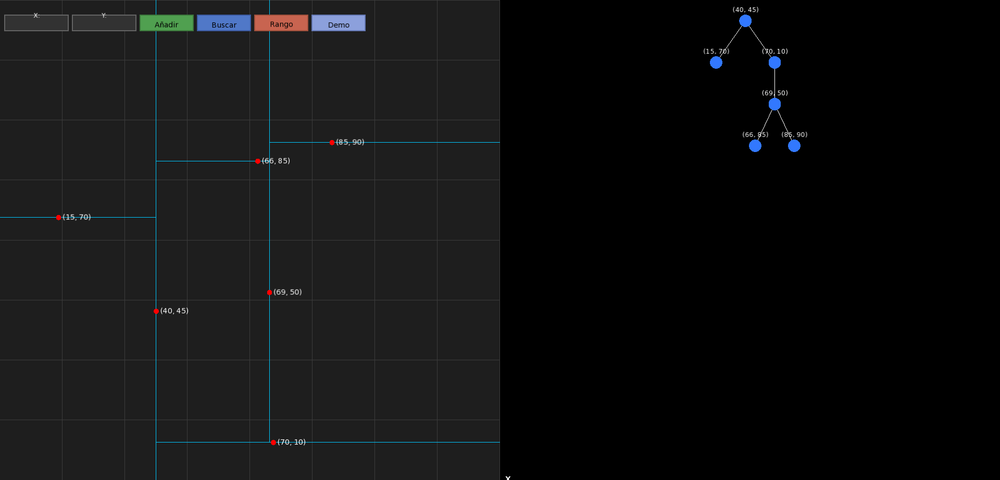
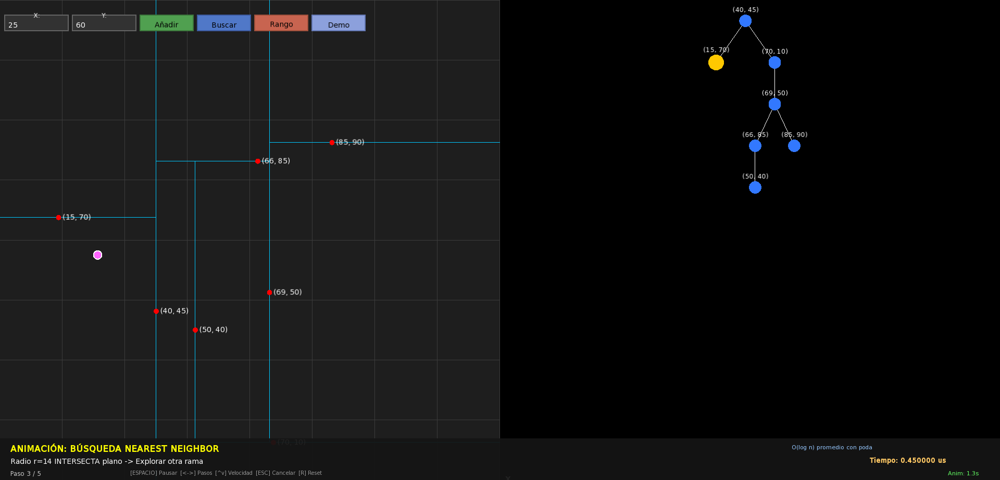
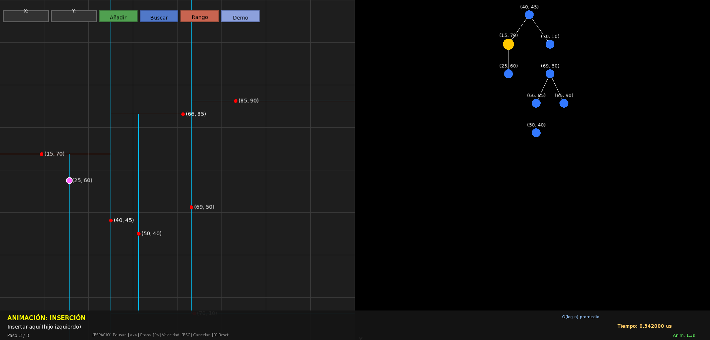

# KD-Tree Implementation & Interactive Visualizer

Implementación completa de un K-D Tree (árbol k-dimensional) para puntos 2D con visualización interactiva en C++ usando SFML 3.

## Estructura del Proyecto

```
├── KDTree.h          # Interfaz del KD-Tree y estructuras de datos
├── KDTree.cpp        # Implementación de algoritmos
├── Visualizer.h/cpp  # Motor de visualización interactivo (SFML 3)
├── main.cpp          # Entry point y unit tests
└── CMakeLists.txt    # Configuración de build
```

## Características Técnicas

### Operaciones Implementadas

| Operación | Complejidad Promedio | Complejidad Peor Caso |
|-----------|---------------------|----------------------|
| **Insert** | O(log n) | O(n) |
| **Nearest Neighbor** | O(log n) | O(n) |
| **k-NN** | O(k log n) | O(n) |
| **Range Search** | O(√n + k) | O(n) |
| **Remove** | O(log n) | O(n) |

### Algoritmos Clave

#### 1. Nearest Neighbor Search
- Búsqueda recursiva con poda espacial basada en distancia al hiperplano divisor
- Optimización: solo explora rama opuesta si `r² ≥ (distancia_al_plano)²`
- Evita exploración exhaustiva mediante partición espacial binaria

#### 2. k-Nearest Neighbors (k-NN)
- Utiliza max-heap para mantener los k mejores candidatos
- Poda: descarta subárboles cuando `distancia_plano ≥ peor_candidato_actual`
- Ordenamiento final por distancia ascendente

#### 3. Range Search (Búsqueda por Rango)
- Búsqueda ortogonal en rectángulo alineado a ejes
- Poda por dimensión: solo explora subárbol si el rectángulo intersecta el hiperplano
- Retorna todos los puntos dentro del rango especificado

#### 4. Deletion
- Implementa reemplazo por mínimo en dimensión discriminante
- Casos: nodo hoja, subárbol derecho presente, solo subárbol izquierdo
- Intercambio de subárboles para normalizar casos

### Estructuras de Datos

```cpp
struct Punto2D {
    float x, y;
};

struct KDNode {
    Punto2D punto;
    KDNode* izquierdo;
    KDNode* derecho;
    int nivel;  // Determina dimensión discriminante (nivel % k)
};
```

## Visualizador Interactivo

### Características
- **Viewport dual**: Plano 2D (izquierda) + Árbol binario (derecha)
- **Animaciones paso a paso**: Visualización de comparaciones, podas y recorridos
- **Demo sintética**: Dataset de 25 puntos con atributos (edad) mapeados a color/tamaño
- **Interacciones**: 
  - Inserción de puntos (click)
  - Búsqueda de vecino más cercano con visualización de ruta
  - Range search con selección rectangular
  - k-NN con resaltado de vecinos

### Compilación y Ejecución

#### Requisitos
- C++17 o superior
- SFML 3.x
- CMake 3.10+

#### Build
```bash
rm -rf build
cmake -S . -B build
cmake --build build -j$(nproc)
```

#### Run
```bash
./build/sfml-app
```

### Controles

| Acción | Control |
|--------|---------|
| Insertar punto | Click izquierdo en plano |
| Buscar vecino | Botón "Buscar" + coordenadas |
| Range search | Botón "Rango" + arrastrar mouse |
| Demo sintética | Botón "Demo" |
| Animación | Controles de pausa/velocidad en panel inferior |

## Detalles de Implementación

### Particionamiento Espacial
- Alternancia de eje discriminante por nivel: `eje = nivel % 2`
- Nivel 0: X, Nivel 1: Y, Nivel 2: X, ...
- Subárbol izquierdo: valores menores en dimensión actual
- Subárbol derecho: valores mayores o iguales

### Optimizaciones
- Cálculo de distancia al cuadrado (evita sqrt costoso)
- Max-heap con `std::vector` y algoritmos STL para k-NN
- Reserva de memoria (`reserve`) para vectores de resultados
- Poda agresiva en búsquedas para evitar exploración innecesaria

### Métricas de Rendimiento
- El visualizador mide y muestra tiempo real de operaciones
- Panel de animación muestra contador de nodos visitados vs. total

## Unit Tests

Incluidos en `main.cpp`:
- Test de eliminación de nodo único
- Test de k-NN con verificación de vecinos correctos
- Validación de ordenamiento por distancia

## Screenshots

### Demo Principal


### Búsqueda por Rango


### Vecino Más Cercano


### Inserción Animada


## Video de Pruebas

Demostración completa del visualizador interactivo con todas las operaciones:

📹 **[Ver video de pruebas en Google Drive](https://drive.google.com/file/d/1kk3NTT4-g7PirqG0hwopKBCS_BFDcGmt/view?usp=sharing)**

## Referencias

- **Paper original**: Bentley, J. L. (1975). "Multidimensional Binary Search Trees Used for Associative Searching"
- **Complejidad range search 2D**: O(√n + k) para árboles balanceados ([Análisis geométrico](https://en.wikipedia.org/wiki/K-d_tree#Range_search))

## Notas Técnicas

- Árbol **no balanceado**: secuencia de inserciones puede degradar a O(n)
- Para dataset estático, construir con partición mediana garantiza balance O(log n)
- SFML 3 requiere APIs actualizadas: `sf::State::Fullscreen`, `window.getSize()`